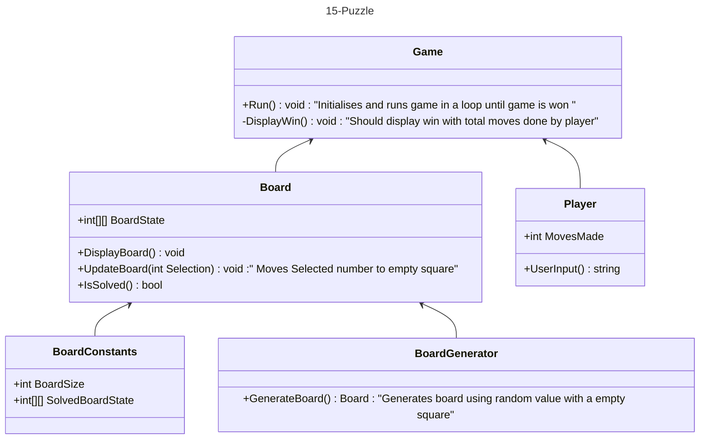

```mermaid
---
title: 15-Puzzle
---

classDiagram

    class Game{
        +Run() void : "Initialises and runs game in a loop until game is won "
        -DisplayWin() void : "Should display win with total moves done by player"
        }
        
    class Board{
        +int[][] BoardState
       
        +DisplayBoard() void
        +UpdateBoard(int Selection) void :" Moves Selected number to empty square"
        +IsSolved() bool
    }
    class BoardGenerator{
        +GenerateBoard() Board : "Generates board using random value with a empty square"
    }

    class BoardConstants{
        +int BoardSize
        +int[][] SolvedBoardState
    }
    class Player{
        +int MovesMade
        +UserInput() string
    }

    Game <-- Board 
    Game <-- Player
    Board <-- BoardConstants
    Board <-- BoardGenerator
    
```