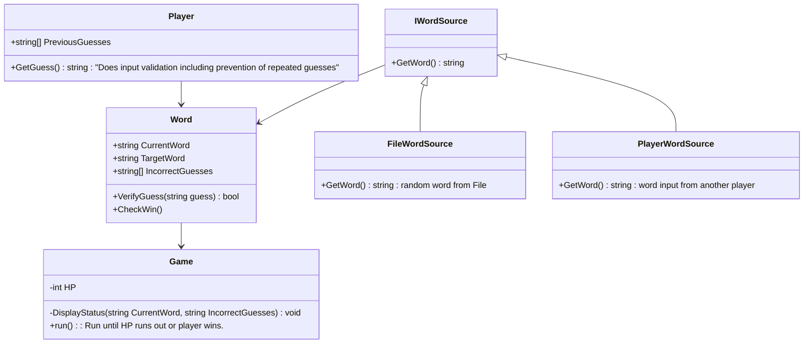

```mermaid
classDiagram

   
    class Game{
        -int HP
        -DisplayStatus(string CurrentWord, string IncorrectGuesses) void
        +run() : Run until HP runs out or player wins.
       
    }
    class Word{
        +string CurrentWord
        +string TargetWord
        +string[] IncorrectGuesses
        
        +VerifyGuess(string guess) bool
        +CheckWin()
        
    }
    
    class Player{
        +string[] PreviousGuesses 
        +GetGuess() string : "Does input validation including prevention of repeated guesses"
    }
    
    class IWordSource{
        +GetWord() string
    }

    class FileWordSource {
        +GetWord() string : random word from File
    }
    class PlayerWordSource{
        +GetWord() string : word input from another player
    }
    
    
    Word --> Game
    Player --> Word
    
    IWordSource --> Word
    IWordSource <|-- FileWordSource
    IWordSource <|-- PlayerWordSource
```