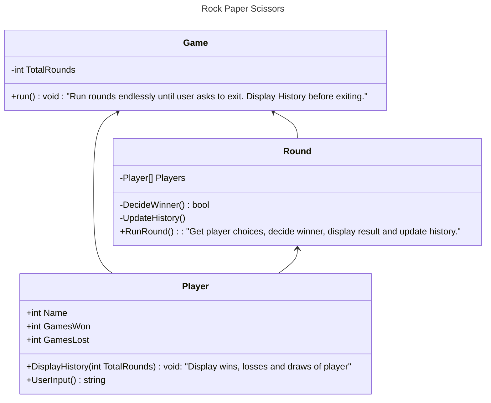

```mermaid
---
title: Rock Paper Scissors
---
classDiagram
    class Game{
        -int TotalRounds
        +run() void : "Run rounds endlessly until user asks to exit. Display History before exiting."
    }
    class Round{
        -Player[] Players
        -DecideWinner() bool 
        -UpdateHistory()
        +RunRound() : "Get player choices, decide winner, display result and update history."
    }
    class Player{
        +int Name
        +int GamesWon
        +int GamesLost
        +DisplayHistory(int TotalRounds) void: "Display wins, losses and draws of player"
        +UserInput() string 
    }
    Game <--Round
    Game <--Player
    Round <-- Player
```