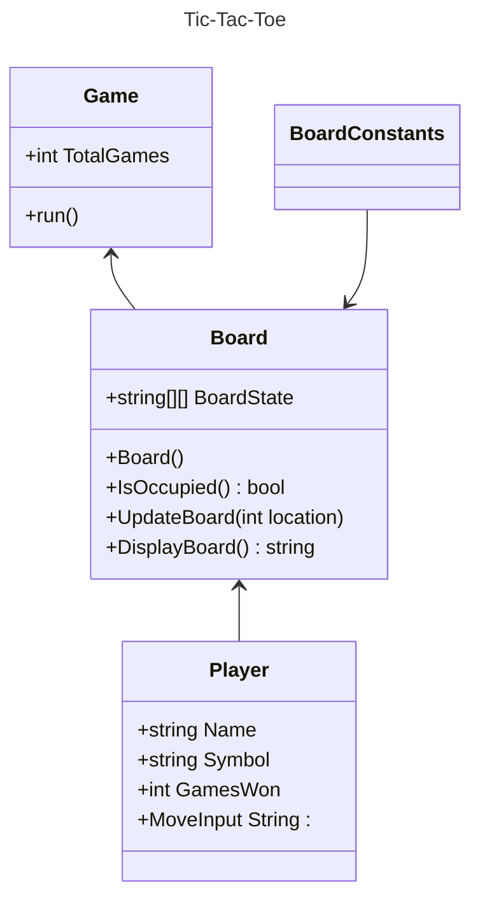

```mermaid
---
title: Tic-Tac-Toe
---
classDiagram
    
    class Game{
        +int TotalGames
        +run()
    }
    

    class Board{
        +string[][] BoardState
        +Board()
        +IsOccupied() bool
        +UpdateBoard(int location)
        +DisplayBoard() string
        
    }
   
    class Player{
        +string Name
        +string Symbol
        +int GamesWon
        +MoveInput String : 
        }
    Board <-- Player
    Game <-- Board
    BoardConstants -->Board

```